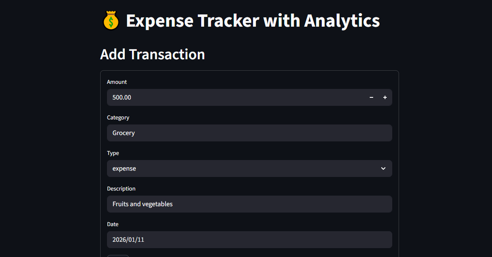
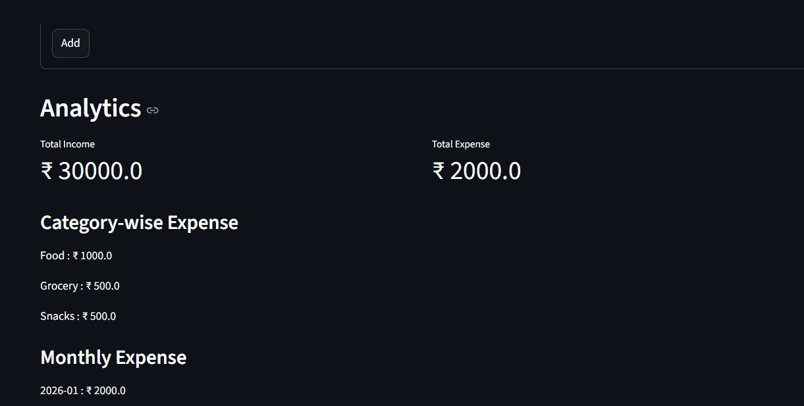
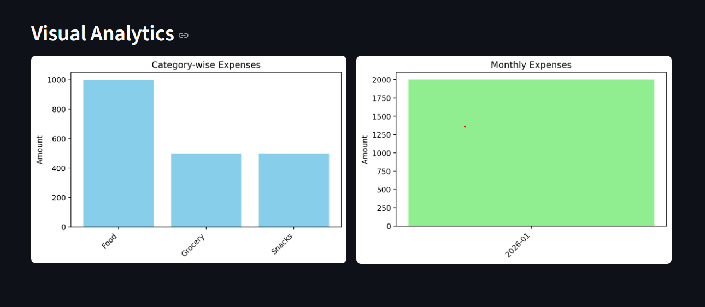

# Expense Tracker with Analytics

A Python-based Expense Tracker application built using **Streamlit** and **SQLite**, designed to help users track income and expenses with **real-time analytics and visualizations**.

This project focuses on **clean backend logic**, **database-driven transactions**, and **practical data analytics**, making it suitable for beginner-to-intermediate Python portfolios.

---

##  Features

### Core Functionality
- Add income and expense transactions
- Store data persistently using SQLite
- Automatic ID generation for each transaction
- Delete individual transactions directly from the table

### Analytics
- Total Income & Total Expense calculation
- Category-wise expense analysis
- Monthly expense analysis
- Bar charts for visual insights

### UI & UX
- Clean Streamlit interface
- Side-by-side analytics charts
- Interactive tables with delete actions

---

## 🛠 Tech Stack

| Layer | Technology |
| Language | Python |
| UI | Streamlit |
| Database | SQLite |
| Data Analysis | Pandas |
| Visualization | Matplotlib |

---

## 📂 Project Structure
Expense_Tracker_With_Analytics/
│
├── app.py # Streamlit UI
├── database.py # SQLite database operations
├── analytics.py # Data analysis & plotting
├── expenses.db # SQLite database
├── requirements.txt
└── README.md

---

## Screenhots





### 1️⃣ Clone the repository
```bash
git clone https://github.com/<shravanijadhav264>/Expense_Tracker_With_Analytics.git
cd Expense_Tracker_With_Analytics

Create & activate virtual environment
python -m venv venv
Windows
venv\Scripts\activate

Install dependencies
pip install -r requirements.txt

Run the application
streamlit run app.py

---


👤 Author

Shravani Jadhav
Data Analytics Enthusiast